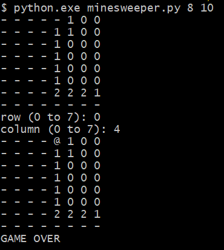

# minesweeper
simple minesweeper game
did that as part of an interview question so why not save it for later...

## clone
```
git clone https://github.com/Nemo20k/minesweeper.git
```

## usage
```
python3 ./minesweeper/minesweeper.py <board_size> <num_of_mines>
```

